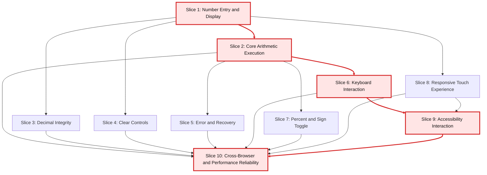

# Web-Based Calculator Vertical Slice Implementation Plan

## Goal and Context

This plan translates the calculator specification into a vertical-slice delivery backlog, aligned to the repository guidance for CQRS and feature-centric implementation. The goal is to deliver a browser-only calculator by shipping complete user capabilities as slices, without organizing work into phases or sprints.

## Slice Design Principles

1. Each slice delivers end-to-end value: UI interaction, command/query behavior, validation, projection updates, and tests.
2. Commands own state mutation; queries read projections only.
3. UI event handlers are thin and delegate to command/query handlers.
4. Validation rules are explicit per slice.
5. Every slice includes regression tests for behavior and accessibility where relevant.

## Ordered Vertical Slices

### Slice 1: Number Entry and Display

Capability:

- Enter digits `0-9` and see immediate display updates.

Implementation scope:

- Entry command handlers for digits.
- Display query projection for canonical current value.
- UI keypad wiring for pointer input.

Acceptance checks:

- Digits render correctly in display.
- Leading zero behavior is deterministic.
- Starting new entry after completed result follows calculator rules.

### Slice 2: Core Arithmetic Execution

Capability:

- Perform `+`, `-`, `x`, and `/` with calculator-style sequential flow.

Implementation scope:

- Operator command handlers.
- Equals command handler.
- Result projection and chaining behavior.

Acceptance checks:

- `2 + 3 = 5`
- `9 - 12 = -3`
- `7 x 6 = 42`
- `8 / 4 = 2`

### Slice 3: Decimal Integrity

Capability:

- Enter decimal values without invalid formats.

Implementation scope:

- Decimal command rules.
- Operand-level validation to prevent duplicate decimal points.
- Display formatting for decimal-first and trailing-decimal cases.

Acceptance checks:

- One decimal point max per active operand.
- Decimal after operator initializes next operand correctly.

### Slice 4: Clear Controls

Capability:

- Support Clear Entry and All Clear with correct state semantics.

Implementation scope:

- `CE` command for active entry reset.
- `AC` command for full calculator reset.
- Projection behavior across pending operation states.

Acceptance checks:

- `CE` resets only current operand.
- `AC` resets full expression state.
- Behavior is correct from entry, result, and pending states.
- Operator replacement remains deterministic after `CE` in pending state (`9 + CE -` replaces operator without eager evaluation).

### Slice 5: Error and Recovery

Capability:

- Handle divide-by-zero gracefully and recover quickly.

Implementation scope:

- Error-state projection for invalid operations.
- Recovery commands for `AC` or fresh valid input.
- Guardrails to prevent broken chained operations after error.

Acceptance checks:

- Division by zero shows readable error state.
- `AC` or new valid input exits error state.

### Slice 6: Keyboard Interaction

Capability:

- Perform full workflow via keyboard.

Implementation scope:

- Keyboard adapter mapping keys to existing commands.
- Enter key and `=` parity.
- Focus handling for consistent keyboard operation.

Acceptance checks:

- Number keys map to digit input.
- `+`, `-`, `*`, `/` map to operator commands.
- `Enter` and `=` evaluate expression.
- Keyboard flow behavior matches button flow.

### Slice 7: Percent and Sign Toggle

Capability:

- Apply percent and positive/negative sign toggle operations.

Implementation scope:

- Percent command uses immediate conversion of the active operand to decimal form (`n%` => `n / 100`).
- Sign-toggle command on active operand.
- Result projection updates for both behaviors.

Acceptance checks:

- Sign toggle flips active operand correctly.
- Percent follows immediate conversion with deterministic results:
  - `10%` => `0.1`
  - `200 + 10% = 200.1`
  - `200 - 10% = 199.9`
  - `200 x 10% = 20`
  - `200 / 10% = 2000`

### Slice 8: Responsive Touch Experience

Capability:

- Reliable, usable interaction across mobile and desktop viewports.

Implementation scope:

- Responsive layout rules.
- Touch target sizing and spacing.
- Stability of button placement across breakpoints.

Acceptance checks:

- Common mobile and desktop viewport layouts remain usable.
- Touch targets are reliably tappable.
- UI remains operable at 200% zoom.

### Slice 9: Accessibility Interaction

Capability:

- Accessible controls and understandable display updates.

Implementation scope:

- Accessible names and labels for controls.
- Visible, logical focus order.
- Announced display-value updates for assistive technologies.

Acceptance checks:

- Keyboard-only navigation is complete and logical.
- Screen reader users receive understandable display updates.
- Automated accessibility scans show zero critical issues.

### Slice 10: Cross-Browser and Performance Reliability

Capability:

- Consistent performance and behavior across supported browsers.

Implementation scope:

- Browser compatibility validation for latest two major versions of Chrome, Edge, Firefox, Safari.
- Input latency measurement.
- Initial interactivity verification under normal conditions.

Acceptance checks:

- Core suite passes in all target browsers.
- Interface is interactive within 2 seconds under normal conditions.
- Median input-to-display latency remains under 100 ms.

## Priority and Rationale

Must Have:

- Slices 1, 2, 3, 4, 5, 6, 8, 9

Rationale:

- These define core correctness, recoverability, keyboard/touch usability, and accessibility baseline.

Should Have:

- Slice 7

Rationale:

- Improves calculator utility while remaining in first-release scope.

Release Gate:

- Slice 10

Rationale:

- Confirms production readiness for performance and browser compatibility.

## Metrics and Definition of Done

1. Functional correctness: 100% pass for core arithmetic behavior tests.
2. Task success: >= 95% completion for basic arithmetic tasks in usability testing.
3. Responsiveness: median input-to-display latency < 100 ms.
4. Accessibility: zero critical automated findings and successful keyboard-only completion of core scenarios.
5. Mobile usability: >= 90% successful tap-based completion for standard calculations.

## Backlog Order

Implement slices in this exact order:

1. Number Entry and Display
2. Core Arithmetic Execution
3. Decimal Integrity
4. Clear Controls
5. Error and Recovery
6. Keyboard Interaction
7. Percent and Sign Toggle
8. Responsive Touch Experience
9. Accessibility Interaction
10. Cross-Browser and Performance Reliability

## Slice Dependency Graph

Critical path: Slice 1 -> Slice 2 -> Slice 6 -> Slice 9 -> Slice 10

Dependency notes:

- Slice 2 depends on Slice 1 because operators and equals require a stable entry/display model.
- Slices 3 and 4 depend on Slice 1 and can proceed independently after Slice 1 is complete.
- Slice 5 depends on Slice 2 because divide-by-zero handling is part of operation execution.
- Slice 6 depends on Slice 2 because keyboard parity requires finalized command semantics.
- Slice 7 depends on Slice 2 because percent/sign behavior modifies active operand in an operation flow.
- Slice 9 depends on Slices 6 and 8 for complete keyboard and responsive accessibility validation.
- Slice 10 is the release gate and depends on all functional and UX slices.
